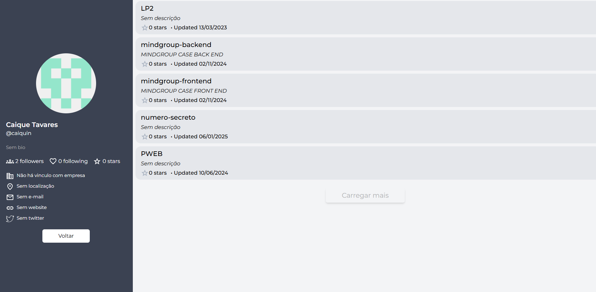

# visualizador-github




> Um visualizador de perfis do github, nele é possivel digitar um nome de usuário do GitHub, e ao clicao no botão "Buscar", será exibido as informações do usuário e seus repositórios públicos

## 💻 Pré-requisitos

Antes de começar, verifique se você atendeu aos seguintes requisitos:

- Necessário ter instalado em sua máquina o `NodeJS`

## 🚀 Instalando visualizador-github

Para instalar o visualizador-github, siga estas etapas:

Execute o comando:

```
npm i
```

## ☕ Usando visualizador-github

Para usar visualizador-github, siga estas etapas:

• Extraia a pasta do projeto
• Execute o index.html em seu navegador
